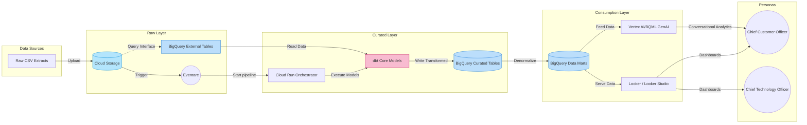

# DRAFT Solutions Architecture
**BigQuery & Gemini Data Warehouse Challenge**

## Table of Contents
1. [Executive Summary](#1-executive-summary)
2. [Target Personas](#2-target-personas)
3. [Architecture Overview: Domain-Oriented Layered Design](#3-architecture-overview-domain-oriented-layered-design)
4. [Infrastructure & Automation](#4-infrastructure--automation)
5. [Data Ingestion & Raw Layer (GCS)](#5-data-ingestion--raw-layer-gcs)
6. [Transformation & Curated Layer (BigQuery + dbt)](#6-transformation--curated-layer-bigquery--dbt)
7. [Consumption Layer & Data Marts (BigQuery)](#7-consumption-layer--data-marts-bigquery)
8. [Generative AI Integration](#8-generative-ai-integration)
9. [Data & AI Governance](#9-data--ai-governance)
10. [Scalability & Security](#10-scalability--security)

---

## 1. Executive Summary
This document outlines the proposed solutions architecture for the intelia Hackathon: BigQuery & Gemini Data Warehouse Challenge. The solution aims to transform raw synthetic retail data (Customers, Products, Orders) into a fully operational, scalable, and intelligent data warehouse on Google Cloud Platform (GCP) that delivers actionable business insights.

## 2. Target Personas
The architecture is designed to serve two primary executive personas:
*   **Chief Customer Officer (CCO):** Focuses on revenue analysis, customer profiling, and retention metrics.
*   **Chief Technology Officer (CTO):** Focuses on platform architecture, system adoption, and performance benchmarks.

## 3. Architecture Overview: Domain-Oriented Layered Design
The foundational data platform is built entirely on **Google Cloud Platform (GCP)**. It follows a domain-oriented, layered architecture with clear separation of concerns across ingestion, storage, transformation, and consumption.

## 4. Infrastructure & Automation
To ensure reliability and reproducibility, the infrastructure is managed as code:
*   **Terraform:** Deploying the entire GCP project, datasets, buckets, service accounts, and IAM policies.
*   **Cloud Build (CI/CD):** Automated deployment and execution of Terraform and dbt pipelines.

## 5. Data Ingestion & Raw Layer (GCS)
*   **Purpose:** Source-aligned, auditable, and immutable storage of the original data.
*   **GCP Services:**
    *   **Cloud Storage (GCS):** The primary storage for raw `.csv` extracts (`gs://intelia-hackathon-files/`). This acts as the unalterable system of record.
    *   **Eventarc & Cloud Run (Automation):** To trigger automated ingestion and transformation pipelines immediately as new delta datasets (orders, customers, products) arrive in the bucket, ensuring the data warehouse is up-to-date for timely insights.
    *   **BigQuery External Tables:** To create a direct query interface over the raw GCS CSV files, bridging the gap to the next layer without moving data immediately.

## 6. Transformation & Curated Layer (BigQuery + dbt)
*   **Purpose:** Prepare a curated and conformed schema. Cleansing, deduplication, standardisation, and resolving domain entities.
*   **GCP Services & Tools:**
    *   **BigQuery (Storage & Compute):** The scalable engine executing the transformations and storing the curated tables.
    *   **dbt Core (Data Build Tool):** The primary transformation framework handling SQL models, tests, and documentation.
    *   **Cloud Run (Orchestration):** Serverless orchestration engine to run the containerized dbt transformation jobs (DAGs). This ensures cost efficiency (fitting the $200 budget) while remaining highly scalable. Triggered iteratively by **Eventarc** (event-driven as new delta files land) or **Cloud Scheduler** (for regular cadences).

## 7. Consumption Layer & Data Marts (BigQuery)
*   **Purpose:** Dimensional and semantic schema optimised for analytics, serving domain-specific KPIs.
*   **GCP Services & Tools:**
    *   **BigQuery Data Marts:** Dedicated datasets holding denormalized fact and dimension tables (Star or Snowflake Schema) tailored for CCO (e.g., `mart_revenue`, `mart_customer_retention`) and CTO (e.g., `mart_system_adoption`).
    *   **Looker / Looker Studio:** The primary BI and visualisation layer providing decision-ready insights for the executives.

## 8. Generative AI Integration
GenAI is embedded into the core of the solution to move beyond static reporting:
*   **Vertex AI Studio:** Integrated for advanced ML and GenAI capabilities.
*   **BigQuery ML (`ML.GENERATE_TEXT`):** Applied to curated or consumption layers to perform sentiment analysis on customer feedback, automate insight generation, or categorize products.
*   **Agentic Workflows:** Implementation of data agents to provide conversational analytics and answer natural language queries directly over the consumption data marts.

## 9. Data & AI Governance (Bonus Objective)
To elevate the solution to enterprise-grade, governance overlays will be implemented:
*   **Dataplex:** Establishing a central data catalogue, tracking data lineage across the three layers, and implementing automated data quality checks.
*   **dbt Docs / dbt Tests:** Supplementing governance by enforcing referential integrity and exposing lineage definitions derived straight from the code.
*   **Model Governance:** Evaluating and monitoring GenAI models effectively.

## 10. Scalability & Security
*   **Robust Codebase:** Modular, DRY (Don't Repeat Yourself) dbt models and Terraform modules to ensure the solution could be scaled to a real client.
*   **Hardening (IAM & VPC SC):** Ensuring least-privilege service accounts (e.g., standardising access separating dbt-runner accounts from human developer read-access).
*   **Cost Management:** A strict GCP budget of $200 per project is enforced, supported by automated billing alerts.
