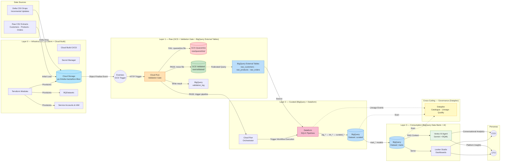

# Solutions Architecture
**BigQuery & Gemini Data Warehouse Challenge**
*intelia Hackathon — v2.1 DRAFT*

---

## Table of Contents
1. [Executive Summary](#1-executive-summary)
2. [Target Personas](#2-target-personas)
3. [Architecture Overview: Domain-Oriented Layered Design](#3-architecture-overview-domain-oriented-layered-design)
4. [Infrastructure & Automation](#4-infrastructure--automation)
5. [Data Ingestion & Raw Layer](#5-data-ingestion--raw-layer)
6. [Transformation & Curated Layer](#6-transformation--curated-layer)
7. [Consumption Layer & Data Marts](#7-consumption-layer--data-marts)
8. [Generative AI Integration](#8-generative-ai-integration)
9. [Data & AI Governance](#9-data--ai-governance)
10. [Scalability & Security](#10-scalability--security)
11. [End-to-End Data Flow & Workflow Orchestration](#11-end-to-end-data-flow--workflow-orchestration)

---

## 1. Executive Summary

This document outlines the proposed solutions architecture for the intelia Hackathon: BigQuery & Gemini Data Warehouse Challenge. The solution transforms raw synthetic retail data (Customers, Products, Orders) into a fully operational, scalable, and intelligent data warehouse on Google Cloud Platform (GCP) that delivers actionable business insights to executive stakeholders.

The architecture follows a **medallion-style, domain-oriented layered design** — Raw → Curated → Consumption — built entirely on native GCP services, with GenAI embedded throughout rather than bolted on. Every layer is governed, hardened for security, and reproducible via Infrastructure-as-Code (IaC), allowing the entire solution to be torn down and redeployed to a net-new GCP project with a single pipeline run.

A **pre-ingestion validation gate** (Cloud Run) sits between file arrival and downstream processing. It enforces schema contracts — column names, count, order, encoding, and file integrity — before any file is permitted to enter the curated pipeline. Files that fail validation are quarantined automatically and never reach BigQuery.

---

## 2. Target Personas

| Persona | Primary Concerns | Key Deliverables |
|---|---|---|
| **Chief Customer Officer (CCO)** | Revenue analysis, customer profiling, retention metrics, churn risk | `mart_revenue`, `mart_customer_retention`, `mart_customer_segments`, conversational analytics agent |
| **Chief Technology Officer (CTO)** | Platform architecture, system adoption, pipeline performance, cost governance | `mart_system_adoption`, pipeline observability dashboard, IaC reproducibility demo, governance scorecard |

---

## 3. Architecture Overview: Domain-Oriented Layered Design

The platform is built entirely on **Google Cloud Platform (GCP)** and follows a strict separation of concerns across four functional layers: **Infrastructure**, **Ingestion / Raw**, **Curated**, and **Consumption**. A cross-cutting **Governance & Security** plane spans all layers.



---

## 4. Infrastructure & Automation

### 4.1 Overview

The entire GCP environment is provisioned and managed via Terraform, enabling full teardown-and-redeploy capability. Cloud Build serves as the CI/CD engine that chains infrastructure provisioning, data pipeline execution, and validation in a single run.

### 4.2 Terraform Modules

All GCP resources are organised into reusable, composable Terraform modules:

| Module | Resources Managed |
|---|---|
| `modules/project` | APIs enabled, billing alerts ($200 cap), project-level labels |
| `modules/storage` | GCS buckets (raw, validated, quarantine, archive, temp), lifecycle rules, versioning, CMEK |
| `modules/bigquery` | Datasets (`raw_external`, `curated`, `marts`, `governance`), table schemas including `validation_log` and `ingestion_log`, default encryption |
| `modules/iam` | Service accounts, IAM bindings (least-privilege roles), Workload Identity |
| `modules/networking` | VPC Service Controls perimeter, Private Google Access |
| `modules/dataplex` | Lakes, zones, assets linked to GCS and BigQuery datasets |
| `modules/monitoring` | Log sinks, alerting policies (including validation failure alerts), budget alerts, dashboard configs |

**Key Terraform patterns:**
- All sensitive values (e.g., service account keys, API tokens) are stored in **Secret Manager** and referenced via `data "google_secret_manager_secret_version"` — never hardcoded in `.tfvars`.
- Remote state is stored in a dedicated GCS bucket with object versioning and state locking.
- `terraform plan` output is posted as a comment on every Cloud Build PR trigger before `apply`.

### 4.3 Cloud Build CI/CD Pipeline

```
Trigger: Push to main / manual dispatch
│
├── Stage 1: terraform init → plan → apply
│   └── Provisions all GCP resources from scratch if needed
│
├── Stage 2: Dataform schema push
│   └── Deploys SQLX models and assertions to the Dataform repository
│
├── Stage 3: Initial data load
│   └── Cloud Run job copies raw CSVs from source bucket → raw layer
│
├── Stage 4: Dataform full refresh execution
│   └── Runs all pipelines: stg_* → int_* → curated_* → mart_*
│
└── Stage 5: Validation
    └── Dataform assertion results + data quality check pass/fail report
```

### 4.4 Service Accounts & IAM Design

Each functional component runs under a dedicated, least-privilege service account:

| Service Account | Purpose | Key Roles |
|---|---|---|
| `sa-terraform@` | IaC provisioning (CI/CD only) | `roles/owner` scoped to project (CI only — not human-accessible) |
| `sa-gcs-ingest@` | Writing raw files to GCS | `roles/storage.objectCreator` on raw bucket only |
| `sa-cloudrun-validator@` | Pre-ingestion schema validation | `roles/storage.objectViewer` on raw bucket; `roles/storage.objectCreator` on validated/quarantine prefixes; `roles/bigquery.dataEditor` on `governance.validation_log` |
| `sa-cloudrun-orchestrator@` | Triggering Dataform executions | `roles/dataform.editor`, `roles/run.invoker` |
| `sa-dataform@` | Running SQL transformations | `roles/bigquery.dataEditor` on curated/marts datasets; `roles/bigquery.jobUser` |
| `sa-vertexai@` | Vertex AI agent and BQML calls | `roles/aiplatform.user`, `roles/bigquery.dataViewer` on marts only |
| `sa-looker@` | BI dashboard read access | `roles/bigquery.dataViewer` on marts datasets only |
| `sa-dataplex@` | Governance scanning | `roles/dataplex.dataReader`, `roles/datacatalog.admin` |

> **No human user account is granted direct BigQuery data access in production.** All interactive access is mediated via Looker or the Vertex AI agent.

---

## 5. Data Ingestion & Raw Layer

### 5.1 Purpose

The Raw layer provides **source-aligned, immutable, and auditable** storage of all original data. Nothing is transformed here — the goal is a faithful landing zone that can be reprocessed if downstream logic changes.

### 5.2 GCS Bucket Structure

```
gs://intelia-hackathon-files/
│
├── raw/
│   ├── customers/
│   │   ├── full/
│   │   │   └── customers_20250101.csv          ← initial full load (landing zone)
│   │   └── delta/
│   │       └── customers_delta_20250315.csv    ← incremental drops (landing zone)
│   ├── products/
│   │   ├── full/
│   │   └── delta/
│   └── orders/
│       ├── full/
│       └── delta/
│
├── validated/                                  ← PASS: files cleared by validation gate
│   ├── customers/
│   ├── products/
│   └── orders/
│
├── quarantine/                                 ← FAIL: rejected files held for review
│   ├── customers/
│   ├── products/
│   └── orders/
│
├── archive/                                    ← post-processing move (from validated/)
└── temp/                                       ← staging for Cloud Run jobs
```

> **Landing vs Validated:** Files land in `raw/` first. The validation gate is the only process permitted to move files to `validated/` or `quarantine/`. External tables are built over `validated/` only — quarantined files never reach BigQuery.

**Bucket configuration:**
- **Versioning:** Enabled — all object versions retained for audit trail.
- **Lifecycle rules:** Objects in `raw/` move to `NEARLINE` after 30 days, `COLDLINE` after 90 days.
- **Retention policy:** 365-day object retention lock on `raw/` prefix — files cannot be deleted within the window.
- **Encryption:** Google-managed CMEK (or Customer-Managed if scoped to real client).
- **Access:** Only `sa-gcs-ingest@` has write access. All other SAs have `objectViewer` only.

### 5.3 BigQuery External Tables

External tables are created over the **validated** GCS prefix (files that have passed the schema validation gate) to enable immediate SQL querying without data movement:

```sql
-- Example: External table over validated customers
CREATE OR REPLACE EXTERNAL TABLE `raw_external.ext_customers`
OPTIONS (
  format = 'CSV',
  uris   = ['gs://intelia-hackathon-files/validated/customers/*.csv'],
  skip_leading_rows = 1,
  field_delimiter = ',',
  hive_partitioning_options = STRUCT(
    mode = 'AUTO',
    source_uri_prefix = 'gs://intelia-hackathon-files/validated/customers/'
  )
);
```

- **Hive partitioning** on the `full/` vs `delta/` path prefix allows the Dataform models to selectively query only new delta files in incremental runs.
- Three external tables are defined: `ext_customers`, `ext_products`, `ext_orders`.

### 5.4 Pre-Ingestion Validation Gate (Cloud Run)

A dedicated Cloud Run service acts as a **schema contract enforcer** between file arrival and downstream processing. No file reaches the curated pipeline — or even the BigQuery external tables — without passing this gate.

#### Design Decision: Cloud Run over Dataflow

Cloud Run is used here rather than Dataflow for the following reasons:

| Criteria | Cloud Run | Dataflow |
|---|---|---|
| **Validation scope** | Header row + sample rows only | Overkill — full file scan |
| **Cold start** | < 2 seconds | 2–3 minutes |
| **Cost** | Pay-per-invocation (~$0.00 per small file) | Minimum job overhead |
| **Complexity** | Single Python container | Apache Beam pipeline required |
| **Fit for purpose** | ✅ Right tool for metadata checks | Better suited to large-scale transforms |

Dataform assertions remain the in-warehouse quality layer for row-level data checks once data is loaded.

#### Validation Checks Performed

| Check | Detail |
|---|---|
| **Column names** | Header row must exactly match expected schema for the detected entity type |
| **Column count** | Number of columns must equal expected count — detects truncated or malformed headers |
| **Column order** | Column sequence must match expected order (external tables are position-sensitive) |
| **Non-empty file** | File must contain at least one data row beyond the header |
| **Encoding** | File must be UTF-8 encoded — rejects BOM or Latin-1 encoded files |
| **Delimiter** | Field delimiter must be a comma — detects tab or pipe corruption |
| **Date format sample** | Samples first 10 rows to verify date columns parse correctly |
| **File size guard** | Rejects suspiciously small files (< 100 bytes) or anomalously large deltas |

#### Expected Schemas (Contract Definitions)

```python
EXPECTED_SCHEMAS = {
    "customers": [
        "customer_id", "first_name", "last_name",
        "email", "signup_date", "region", "loyalty_tier"
    ],
    "products": [
        "product_id", "product_name", "category",
        "unit_price", "stock_quantity", "supplier_id"
    ],
    "orders": [
        "order_id", "customer_id", "product_id",
        "order_date", "quantity", "total_amount", "status"
    ]
}
```

These schema contracts are version-controlled in Git alongside the Dataform SQLX models. Any schema change requires a deliberate contract update and redeployment — preventing silent schema drift.

#### Validation Outcome Routing

```
File arrives in gs://.../raw/{entity}/delta/
    │
    ▼
Cloud Run Validator (sa-cloudrun-validator@)
    │
    ├── Reads object metadata + header row only (no full file scan)
    ├── Detects entity type from GCS object path
    ├── Runs all validation checks against EXPECTED_SCHEMAS[entity]
    │
    ├── PASS ──► Copy file to gs://.../validated/{entity}/
    │            Write PASS record to governance.validation_log
    │            Invoke Cloud Run Orchestrator → trigger Dataform
    │
    └── FAIL ──► Copy file to gs://.../quarantine/{entity}/
                 Write FAIL record to governance.validation_log
                   (includes: filename, failed check, expected vs actual values)
                 Publish alert to Cloud Monitoring / PubSub
                 Pipeline halted — Dataform NOT triggered
```

#### Validation Log Schema (`governance.validation_log`)

| Column | Type | Description |
|---|---|---|
| `validation_id` | STRING | UUID for this validation run |
| `file_name` | STRING | GCS object name |
| `entity_type` | STRING | customers / products / orders |
| `validation_timestamp` | TIMESTAMP | When validation ran |
| `outcome` | STRING | PASS / FAIL |
| `failed_check` | STRING | Name of the failing check (null on PASS) |
| `expected_value` | STRING | What was expected (e.g. column list) |
| `actual_value` | STRING | What was found in the file |
| `row_count_sample` | INTEGER | Number of data rows checked |
| `file_size_bytes` | INTEGER | File size at time of validation |

This table feeds directly into the **CTO Looker Studio dashboard** as a data quality and pipeline health indicator, and is scanned by Dataplex as part of the governance layer.

#### Alerting on Validation Failure

A Cloud Monitoring alert policy fires when `outcome = 'FAIL'` is written to `validation_log`. The alert:
- Posts to a designated Slack/email channel (configured via Terraform `modules/monitoring`)
- Includes: file name, entity type, failed check, and expected vs actual values
- Links directly to the quarantine GCS path for manual inspection

### 5.5 Ingestion Trigger Workflow (Event-Driven, Post-Validation)

```
New delta file lands in GCS (raw/ landing zone)
    │
    ▼
Eventarc (Object Finalised event on gs://.../raw/**/delta/**)
    │
    ▼
Cloud Run Validator (sa-cloudrun-validator@)
    │   1. Reads GCS object metadata + header row
    │   2. Detects entity type from object path
    │   3. Runs schema contract checks
    │   4. Writes result to governance.validation_log
    │
    ├── FAIL ──► File moved to raw/quarantine/
    │            Alert fired. Pipeline stops here.
    │
    └── PASS ──► File moved to raw/validated/
                 │
                 ▼
             Cloud Run Orchestrator (sa-cloudrun-orchestrator@)
                 │   Parses entity type
                 │   Logs to pipeline_runs.ingestion_log
                 │
                 ▼
             Dataform Workflow Execution API
                 │   Triggers incremental run for detected entity tag
                 │
                 ▼
             Dataform executes stg_* → int_* → curated_* → mart_* chain
```

### 5.6 Data Model — Raw Layer

The raw layer is **schema-on-read** via external tables. No transformations are applied. Column names and types mirror the source CSV headers exactly.

| Table | Key Raw Columns (illustrative) |
|---|---|
| `ext_customers` | `customer_id`, `first_name`, `last_name`, `email`, `signup_date`, `region`, `loyalty_tier` |
| `ext_products` | `product_id`, `product_name`, `category`, `unit_price`, `stock_quantity`, `supplier_id` |
| `ext_orders` | `order_id`, `customer_id`, `product_id`, `order_date`, `quantity`, `total_amount`, `status` |

---

## 6. Transformation & Curated Layer

### 6.1 Purpose

The Curated layer applies **cleansing, deduplication, standardisation, and domain conforming** to produce a single, trusted version of each entity. This is the "source of truth" layer that all downstream marts and AI workloads read from.

### 6.2 Dataform Project Structure

```
dataform/
├── dataform.json                  ← project config (defaultDatabase, defaultSchema, assertionSchema)
├── package.json
│
├── definitions/
│   ├── sources/
│   │   └── sources.js             ← declares external table refs (raw_external.ext_*)
│   │
│   ├── staging/                   ← stg_* models: type casting, column renaming, null handling
│   │   ├── stg_customers.sqlx
│   │   ├── stg_products.sqlx
│   │   └── stg_orders.sqlx
│   │
│   ├── intermediate/              ← int_* models: business logic, dedup, enrichment
│   │   ├── int_customers_deduped.sqlx
│   │   ├── int_orders_enriched.sqlx
│   │   └── int_product_inventory.sqlx
│   │
│   ├── curated/                   ← curated_* models: final conformed entities
│   │   ├── curated_customers.sqlx
│   │   ├── curated_products.sqlx
│   │   └── curated_orders.sqlx
│   │
│   └── marts/                     ← mart_* models: denormalized, persona-specific
│       ├── cco/
│       │   ├── mart_revenue.sqlx
│       │   ├── mart_customer_retention.sqlx
│       │   └── mart_customer_segments.sqlx
│       └── cto/
│           ├── mart_system_adoption.sqlx
│           └── mart_pipeline_performance.sqlx
│
├── assertions/                    ← data quality tests
│   ├── assert_no_null_customer_ids.sqlx
│   ├── assert_order_amounts_positive.sqlx
│   └── assert_referential_integrity_orders.sqlx
│
└── includes/
    └── utils.js                   ← reusable macros (e.g. surrogate key generation)
```

### 6.3 Data Modeling Approach — Curated Layer

The curated layer uses a **normalised, entity-centric model**. Each table represents a single business entity with cleansed and conformed attributes. The design principle is **one version of the truth per entity**.

**Staging models (`stg_*`)** — lightweight, 1:1 with source:
- Cast all columns to correct data types (e.g., `PARSE_DATE`, `SAFE_CAST`)
- Rename columns to `snake_case` standard
- Add ingestion metadata: `_loaded_at TIMESTAMP`, `_source_file STRING`
- Filter out fully null rows

**Intermediate models (`int_*`)** — business logic and enrichment:
- **Deduplication:** `ROW_NUMBER() OVER (PARTITION BY customer_id ORDER BY _loaded_at DESC) = 1` to retain the latest record per key — handles delta drops correctly.
- **Referential joins:** Enrich orders with customer region and product category for downstream use.
- **Derived fields:** `days_since_signup`, `order_value_band`, `is_repeat_customer`

**Curated models (`curated_*`)** — final conformed entities:
- Materialised as **BigQuery tables** (not views) for performance.
- Incremental strategy: `MERGE` on surrogate key — new/changed records upserted, historical records preserved with `valid_from` / `valid_to` for Slowly Changing Dimension (SCD Type 2) on key entities like `curated_customers`.

```sql
-- Example: SCD Type 2 pattern in curated_customers.sqlx
config {
  type: "incremental",
  schema: "curated",
  uniqueKey: ["customer_surrogate_key"],
  description: "Conformed customer dimension with SCD Type 2 history"
}

MERGE ${self()} AS target
USING (
  SELECT
    ${utils.surrogate_key(['customer_id'])} AS customer_surrogate_key,
    customer_id,
    email,
    loyalty_tier,
    region,
    _loaded_at AS valid_from,
    CAST(NULL AS TIMESTAMP) AS valid_to,
    TRUE AS is_current
  FROM ${ref('int_customers_deduped')}
) AS source
ON target.customer_surrogate_key = source.customer_surrogate_key
  AND target.is_current = TRUE
WHEN MATCHED AND (target.loyalty_tier != source.loyalty_tier OR target.region != source.region) THEN
  UPDATE SET target.valid_to = source.valid_from, target.is_current = FALSE
WHEN NOT MATCHED THEN
  INSERT ROW
```

### 6.4 Dataform Assertions (Data Quality)

| Assertion | What it checks |
|---|---|
| `assert_no_null_customer_ids` | `customer_id IS NOT NULL` across `stg_customers` |
| `assert_no_null_order_ids` | `order_id IS NOT NULL` across `stg_orders` |
| `assert_order_amounts_positive` | `total_amount > 0` for all completed orders |
| `assert_referential_integrity_orders` | Every `customer_id` in orders exists in curated_customers |
| `assert_product_price_non_negative` | `unit_price >= 0` across all products |
| `assert_no_duplicate_orders` | No duplicate `order_id` in `curated_orders` |

Failed assertions surface in the Dataform execution log and also write a failure record to `governance.quality_failures` for Dataplex to pick up.

### 6.5 Incremental vs Full Refresh Strategy

| Run Type | Trigger | Scope | Use Case |
|---|---|---|---|
| **Full Refresh** | Manual / CI/CD deploy | All models re-run from scratch | Initial load, schema changes |
| **Incremental** | Eventarc delta drop | Only affected entity models | Delta file arrives mid-hackathon |

---

## 7. Consumption Layer & Data Marts

### 7.1 Purpose

The Consumption layer exposes **denormalized, persona-optimised fact and dimension structures** directly readable by Looker Studio and Vertex AI. The design principle here shifts from normalisation to **query performance and analyst ergonomics**.

### 7.2 Data Modeling Approach — Star Schema

All mart tables follow a **Star Schema** pattern: a central fact table surrounded by flattened dimension tables. This minimises join complexity for BI tools and Vertex AI SQL agents.

```
                    ┌──────────────────┐
                    │  dim_customers   │
                    │  (surrogate_key) │
                    └────────┬─────────┘
                             │
┌──────────────┐   ┌────────▼─────────┐   ┌──────────────────┐
│ dim_products │───│   fact_orders    │───│    dim_date      │
│ (product_sk) │   │  (grain: 1 row   │   │  (date_id)       │
└──────────────┘   │   per order line)│   └──────────────────┘
                   └──────────────────┘
```

### 7.3 CCO Data Mart — Detail

**`mart_revenue`**

| Column | Type | Description |
|---|---|---|
| `order_date` | DATE | Order transaction date |
| `region` | STRING | Customer region |
| `product_category` | STRING | Product category |
| `total_revenue` | NUMERIC | Sum of order amounts |
| `order_count` | INTEGER | Number of orders |
| `avg_order_value` | NUMERIC | Average order value |
| `revenue_wow_pct` | FLOAT | Week-on-week revenue change % |

**`mart_customer_retention`**

| Column | Type | Description |
|---|---|---|
| `customer_id` | STRING | Customer identifier |
| `cohort_month` | DATE | Month of first purchase |
| `months_since_first_order` | INTEGER | Time-based retention bucket |
| `is_active_30d` | BOOL | Purchased in last 30 days |
| `is_active_90d` | BOOL | Purchased in last 90 days |
| `lifetime_value` | NUMERIC | Total spend to date |
| `churn_risk_score` | FLOAT | BQML-generated churn probability (0–1) |
| `loyalty_tier` | STRING | Current loyalty tier |

**`mart_customer_segments`**

| Column | Type | Description |
|---|---|---|
| `customer_id` | STRING | Customer identifier |
| `rfm_recency_score` | INTEGER | Days since last order (scored 1–5) |
| `rfm_frequency_score` | INTEGER | Order frequency (scored 1–5) |
| `rfm_monetary_score` | INTEGER | Total spend quintile (scored 1–5) |
| `rfm_segment` | STRING | Derived segment: Champions, At Risk, Lost, etc. |
| `ai_generated_summary` | STRING | BQML `ML.GENERATE_TEXT` customer narrative |

### 7.4 CTO Data Mart — Detail

**`mart_system_adoption`**

| Column | Type | Description |
|---|---|---|
| `run_date` | DATE | Pipeline execution date |
| `pipeline_name` | STRING | Dataform workflow name |
| `rows_processed` | INTEGER | Records processed in run |
| `duration_seconds` | FLOAT | End-to-end pipeline duration |
| `bytes_billed` | INTEGER | BigQuery slot usage for cost tracking |
| `status` | STRING | SUCCESS / FAILED / PARTIAL |
| `assertion_failures` | INTEGER | Number of data quality failures |

**`mart_pipeline_performance`** — feeds the CTO's observability dashboard, tracking slot efficiency, incremental run cadence, and cost per pipeline execution against the $200 budget.

### 7.5 Looker Studio Dashboard Design

Two dedicated Looker Studio reports are built, one per persona:

**CCO Report — "Customer & Revenue Intelligence"**
- Revenue trend (daily / weekly / monthly) with region filter
- Customer retention cohort heatmap
- RFM segment distribution (pie + trend)
- Top 10 products by revenue
- Churn risk scorecard (count of At Risk / Lost customers)
- AI-generated insight panel (pulling from `ai_generated_summary`)

**CTO Report — "Platform Health & Adoption"**
- Pipeline run history (success/failure rate)
- Cost consumption vs $200 budget (gauge)
- Data freshness indicators per entity
- Row volume trends across all three entities
- Assertion failure log table
- Data governance scorecard (Dataplex quality scores)

---

## 8. Generative AI Integration

### 8.1 Design Philosophy

GenAI is embedded at **three distinct points** in the architecture — not added as a demonstration afterthought:

1. **In-pipeline enrichment** (Curated → Mart layer, via BQML)
2. **Analytical agent** (Consumption layer, via Vertex AI)
3. **Insight automation** (Scheduled, via Cloud Run + BQML)

### 8.2 BigQuery ML — In-Pipeline GenAI (`ML.GENERATE_TEXT`)

A remote model connection is established in BigQuery pointing to Gemini via Vertex AI:

```sql
-- Create the remote Gemini model connection
CREATE OR REPLACE MODEL `curated.gemini_pro`
  REMOTE WITH CONNECTION `us.vertex-ai-connection`
  OPTIONS (endpoint = 'gemini-1.5-pro');
```

**Use case 1: Customer narrative generation** (runs as part of `mart_customer_segments` build)
```sql
SELECT
  customer_id,
  ML.GENERATE_TEXT(
    MODEL `curated.gemini_pro`,
    CONCAT(
      'You are a retail analyst. In 2 sentences, summarise this customer: ',
      'Segment: ', rfm_segment, ', ',
      'LTV: $', CAST(lifetime_value AS STRING), ', ',
      'Last order: ', CAST(days_since_last_order AS STRING), ' days ago, ',
      'Loyalty tier: ', loyalty_tier
    ),
    STRUCT(0.2 AS temperature, 100 AS max_output_tokens)
  ).ml_generate_text_llm_result AS ai_generated_summary
FROM mart_customer_segments_base
```

**Use case 2: Product category enrichment** — uses `ML.GENERATE_TEXT` to infer missing product sub-categories from product name and description.

**Use case 3: Churn risk scoring** — a BigQuery ML logistic regression model (`ML.CREATE_MODEL` with `model_type='LOGISTIC_REG'`) trained on order recency, frequency, and monetary features to produce `churn_risk_score` in `mart_customer_retention`.

### 8.3 Vertex AI Conversational Analytics Agent

A **Vertex AI Agent** (using the Agent Builder / Reasoning Engine) is deployed to provide natural language query capability directly over the data marts.

**Agent architecture:**
```
User natural language query
    │
    ▼
Vertex AI Agent (Gemini 1.5 Pro foundation)
    │   System prompt: data mart schemas, business context, persona rules
    │
    ├── Tool: BigQuery SQL executor
    │       Generates and executes SQL against marts dataset
    │       Returns structured result sets
    │
    ├── Tool: Looker Studio link resolver
    │       Returns direct links to relevant dashboard sections
    │
    └── Tool: Insight summariser
            Generates plain-English narrative from query results
    │
    ▼
Response: natural language answer + supporting data table + dashboard link
```

**Example queries the agent handles:**
- *"Which customer segment has the highest churn risk this month?"*
- *"What was revenue last week vs the same week last year by region?"*
- *"Show me the top 5 products driving growth in the Southern region."*

### 8.4 Scheduled Insight Generation

A Cloud Run job (triggered nightly via Cloud Scheduler) runs a suite of BQML insight queries and writes results to a `governance.ai_insights` table, which surfaces in both Looker dashboards as an "AI Insight of the Day" panel.

---

## 9. Data & AI Governance

### 9.1 Dataplex Configuration

Dataplex is configured as a **unified governance layer** spanning all three data layers:

```
Dataplex Lake: intelia-retail-lake
│
├── Zone: raw-zone (RAW type)
│   └── Asset: gs://intelia-hackathon-files/raw/  (GCS asset)
│
├── Zone: curated-zone (CURATED type)
│   └── Asset: bigquery://project/curated  (BQ dataset asset)
│
└── Zone: consumption-zone (CURATED type)
    └── Asset: bigquery://project/marts  (BQ dataset asset)
```

**Dataplex capabilities enabled:**

| Capability | Configuration |
|---|---|
| **Data Catalogue** | All BQ tables auto-registered; business glossary terms attached to key columns (`customer_id`, `revenue`, `churn_risk_score`) |
| **Data Lineage** | Automatic lineage captured from BigQuery jobs; Dataform workflow lineage published via API |
| **Data Quality Scans** | Daily scans on `curated.*` and `marts.*` — null checks, range checks, uniqueness checks |
| **Policy Tags** | PII columns (`email`, `first_name`, `last_name`) tagged with `policy_tag:pii` — column-level access control enforced |

### 9.2 Data Lineage Map

```
gs://intelia-hackathon-files/raw/customers/
    └──► ext_customers (External Table)
             └──► stg_customers
                      └──► int_customers_deduped
                               └──► curated_customers
                                        ├──► mart_revenue
                                        ├──► mart_customer_retention
                                        └──► mart_customer_segments
                                                 └──► [Vertex AI Agent]
                                                 └──► [Looker Studio CCO Report]
```

### 9.3 PII Handling & Column-Level Security

All columns classified as PII are tagged using BigQuery **Policy Tags** via the Data Catalog taxonomy:

```
Taxonomy: intelia-data-classification
├── PII (policy_tag:pii)
│   ├── Restricted columns: email, first_name, last_name, phone
│   └── Access: sa-dataform@ (transform only), NOT granted to sa-looker@ or sa-vertexai@
└── Internal (policy_tag:internal)
    └── All other business columns — readable by all mart service accounts
```

Looker Studio and the Vertex AI agent operate on mart tables that contain **hashed or excluded PII** — `customer_id` (surrogate key) is used throughout, never raw email or name fields.

### 9.4 Model Governance

| Component | Governance Action |
|---|---|
| BQML Churn Model | Evaluated via `ML.EVALUATE` — precision, recall, ROC-AUC logged to `governance.model_evaluations` |
| Gemini text generation | Prompt templates versioned in Git; output quality monitored via a random sample review job |
| Vertex AI Agent | Tool call logs written to Cloud Logging; usage metrics tracked in `mart_system_adoption` |

---

## 10. Scalability & Security

### 10.1 Security Architecture Summary

| Control | Implementation |
|---|---|
| **Least Privilege** | 8 dedicated service accounts, each with minimum necessary roles — no shared accounts |
| **Pre-ingestion Validation** | Schema contract enforced by Cloud Run validator before any file reaches BigQuery — failed files quarantined, pipeline halted |
| **No human data access** | All interactive access via Looker / Vertex AI Agent only |
| **VPC Service Controls** | A VPC-SC perimeter restricts BigQuery, GCS, and Vertex AI API access to within the project boundary |
| **Secret Manager** | All credentials, API keys, and tokens stored in Secret Manager — never in code or env vars |
| **Policy Tags (BCLS)** | Column-level PII protection enforced via BigQuery Column-Level Security |
| **Audit Logging** | Data Access audit logs enabled for BigQuery and GCS — all read/write events captured in Cloud Logging and exported to BigQuery for review |
| **Object Retention** | GCS raw bucket has a 365-day retention lock — data cannot be deleted within the window |

### 10.2 IAM Hardening Checklist

- [ ] No `roles/editor` or `roles/owner` granted to any service account used at runtime
- [ ] No service account keys generated — Workload Identity used for Cloud Run and Cloud Build
- [ ] `allUsers` and `allAuthenticatedUsers` IAM bindings explicitly denied at org policy level
- [ ] `constraints/iam.disableServiceAccountCreation` — only `sa-terraform@` can create SAs, and only during provisioning
- [ ] Terraform `prevent_destroy = true` on the raw GCS bucket and BigQuery curated dataset

### 10.3 Cost Management

- Billing alerts configured at 50%, 75%, and 90% of the $200 budget threshold via Terraform.
- BigQuery slot usage tracked per pipeline run in `mart_pipeline_performance`.
- External tables over GCS avoid storage duplication costs — raw data is not copied into BigQuery native storage until the curated layer.
- Dataform incremental models minimise bytes processed on delta runs by reading only the new partition.
- Cloud Run orchestrator is serverless (pay-per-invocation) — no idle compute cost.

### 10.4 Reproducibility Guarantee

The entire solution can be deployed to a net-new, empty GCP project by running a single Cloud Build trigger. The deployment sequence is:

```
1. terraform apply          → all GCP resources provisioned
2. dataform push-git        → SQLX models deployed to Dataform repository
3. cloud-run-job: seed      → raw CSVs copied from source GCS bucket
4. cloud-run-job: execute   → full Dataform refresh (all layers)
5. cloud-run-job: validate  → all assertions pass, quality scan initiated
```

Estimated full deploy time: < 15 minutes to a functional, fully loaded data warehouse.

---

## 11. End-to-End Data Flow & Workflow Orchestration

### 11.1 Initial Load Workflow

```
Day 0 — Full Load
─────────────────────────────────────────────────────────────────────────────
 [Source]       Raw CSVs available at gs://intelia-hackathon-files/

 [Step 1]       Cloud Build triggers terraform apply
                → GCS bucket, BQ datasets, service accounts, IAM all provisioned

 [Step 2]       Cloud Build triggers Dataform schema push
                → SQLX models, assertions, and sources registered

 [Step 3]       Cloud Build triggers Cloud Run seed job
                → Copies customers_full.csv, products_full.csv, orders_full.csv
                  into gs://intelia-hackathon-files/raw/*/full/

 [Step 4]       Cloud Build triggers Dataform full-refresh execution
                → stg_* → int_* → curated_* → mart_* all run in DAG order
                → Assertions validated; failures logged

 [Step 5]       Dataplex scans triggered
                → Data quality scores computed and catalogued

 [Step 6]       Looker Studio dashboards connect to mart_* datasets
                → CCO and CTO reports immediately available
─────────────────────────────────────────────────────────────────────────────
```

### 11.2 Delta Load Workflow (Event-Driven)

```
Intra-Hackathon — Delta Drop (e.g. new orders file arrives)
─────────────────────────────────────────────────────────────────────────────
 [Trigger]      orders_delta_20250315.csv lands in
                gs://intelia-hackathon-files/raw/orders/delta/

 [Step 1]       Eventarc fires "Object Finalised" event
                → Payload contains: bucket, object name, timestamp

 [Step 2]       Cloud Run Validator receives event (sa-cloudrun-validator@)
                → Detects entity type: "orders" from object path
                → Reads file header row only (no full scan)
                → Runs schema contract checks:
                     ✓ Column names match EXPECTED_SCHEMAS["orders"]
                     ✓ Column count = 7
                     ✓ Column order correct
                     ✓ File non-empty, UTF-8, comma-delimited
                     ✓ Date format sample passes on order_date column

                IF FAIL:
                → File moved to gs://.../quarantine/orders/
                → FAIL record written to governance.validation_log
                → Cloud Monitoring alert fired
                → Pipeline halted — Dataform NOT triggered

                IF PASS:
                → File moved to gs://.../validated/orders/
                → PASS record written to governance.validation_log
                → Cloud Run Orchestrator invoked

 [Step 3]       Cloud Run Orchestrator receives trigger (sa-cloudrun-orchestrator@)
                → Parses entity type from validated file path ("orders")
                → Writes ingestion log record to pipeline_runs.ingestion_log
                → Calls Dataform API: trigger incremental execution for orders tag

 [Step 4]       Dataform incremental run executes (orders tag only)
                → stg_orders (incremental) → int_orders_enriched → curated_orders
                → mart_revenue, mart_customer_retention updated

 [Step 5]       Assertions re-run on affected models
                → Any failures written to governance.quality_failures

 [Step 6]       BQML insight generation re-runs for orders domain
                → Updated churn scores, revenue summaries written to marts

 [Step 7]       Looker Studio dashboards reflect updated data
                → Near-real-time: end-to-end latency target < 5 minutes
                   (validation gate adds < 30 seconds to total latency)
─────────────────────────────────────────────────────────────────────────────
```

### 11.3 Conversational Analytics Workflow

```
CCO natural language query: "Which regions are at risk of revenue decline?"
─────────────────────────────────────────────────────────────────────────────
 [Step 1]       Query received by Vertex AI Agent

 [Step 2]       Agent reasons over system prompt (schema context, persona rules)
                → Identifies relevant mart: mart_revenue
                → Constructs SQL:
                     SELECT region,
                            SUM(total_revenue) AS current_revenue,
                            revenue_wow_pct
                     FROM `marts.mart_revenue`
                     WHERE order_date >= DATE_SUB(CURRENT_DATE(), INTERVAL 7 DAY)
                     ORDER BY revenue_wow_pct ASC
                     LIMIT 5

 [Step 3]       BigQuery executes query via agent tool call
                → Returns structured result set

 [Step 4]       Agent generates narrative response:
                "The Southern and Western regions show the steepest week-on-week
                 revenue declines at -12% and -8% respectively. The primary driver
                 appears to be a drop in repeat orders from loyalty tier 'Bronze'
                 customers. Recommend reviewing the Bronze retention campaign."

 [Step 5]       Response returned to CCO with result table + Looker Studio link
─────────────────────────────────────────────────────────────────────────────
```
